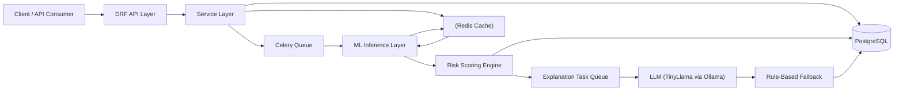

# AEGIS-AI-Powered Fraud Detection and Risk Scoring System

A production-grade backend system designed to detect fraudulent transactions in real time using machine learning, asynchronous processing, and explainable AI.

This project demonstrates a scalable architecture combining Django REST Framework, Celery, Redis, PostgreSQL, and local LLMs to simulate real-world fintech fraud detection systems.

---

## Overview

The system ingests financial transactions, evaluates fraud probability using a trained ML model, assigns a risk score, and generates human-readable explanations using a hybrid LLM + rule-based approach.

The architecture is modular, scalable, and designed with production best practices.

---

## Key Features

### Real-Time Transaction Ingestion
- REST API built with Django REST Framework  
- Validates and stores transaction data  
- Supports idempotency using external transaction IDs  

### Asynchronous Fraud Detection Pipeline
- Powered by Celery with RabbitMQ  
- Non-blocking processing for high throughput  
- Automatic retries with backoff for fault tolerance  

### Machine Learning-Based Fraud Detection
- Model trained using LightBGM  
- Predicts fraud probability for each transaction  
- Encoders persisted to ensure training–serving consistency  

### Risk Scoring Engine
- Converts probability into interpretable risk scores (0–100)  
- Categorizes transactions into Low, Medium, High risk  
- Generates decisions: APPROVE, FLAG, BLOCK  

### Explainable AI (LLM + Fallback)
- Uses TinyLlama via Ollama for explanation generation  
- Produces human-readable reasoning for decisions  
- Rule-based fallback ensures reliability if LLM fails  

### Redis Caching
- Caches predictions to reduce redundant ML computation  
- Improves system performance and response time  

### Audit Logging
- Tracks transaction lifecycle events  
- Stores metadata for debugging and compliance  

### Idempotent Processing
- Prevents duplicate transaction processing  
- Ensures consistency in distributed systems  

### Load Testing Ready
- Includes Locust configuration for performance testing  

---

## Architecture


---

## Workflow

1. Client sends transaction request
2. API layer validates and forwards request
3. Service layer stores transaction in database
4. Celery task is triggered asynchronously
5. ML model performs fraud prediction
6. Risk engine computes score and decision
7. RiskAssessment stored with placeholder explanation
8. Explanation task triggers LLM (TinyLlama)
9. If LLM fails, rule-based fallback is used
10. Final explanation is updated in the database

---

## API Endpoint

```http
    POST /api/v1/transactions/
```
### Request

```json
    {
  "user": 1,
  "amount": 75000,
  "location": "delhi",
  "device": "iphone",
  "timestamp": "2026-04-02T10:30:00Z",
  "external_id": "txn_123"
  }
```
### Response

```json
    {
  "message": "Transaction received",
  "transaction_id": 1,
  "status": "PENDING"
   }
```
---
## Project Structure
apps/

├── transactions/

├── users/

├── ml/

├── explanations/

├── risk_engine/

core/

config/

docker/

---

# Tech Stack

- Backend: Django, Django REST Framework
- Database: PostgreSQL
- Async Processing: Celery
- Message Broker: Redis
- Cache: Redis
- Machine Learning: Scikit-learn
- LLM: TinyLlama via Ollama
- Containerization: Docker, Docker Compose
- Load Testing: Locust

---

## Running the Project

### Prerequisites
- Docker and Docker Compose
- Python 3.11 (optional for local development)
- Ollama installed

### Start Services
```bash
    docker-compose up --build
```

### Run Migrations
``` bash
    docker-compose run web python manage.py migrate
```

### Start LLM
```bash
    ollama run tinyllama
```
### NOTE
- If inside dev container run normal python and django commands.

## Design Highlights
- Clean architecture with clear separation of concerns
- Asynchronous processing for scalability
- Hybrid explainability system (LLM + rule-based fallback)
- Fault-tolerant system with retries and caching
- Production-ready modular design

---

## Feature Improvements
- Model versioning and A/B testing
- Feature store integration
- SHAP-based explainability
- Kafka-based event streaming
- Monitoring dashboards with Prometheus and Grafana

---

## Author
- Kumar Shaswat
---

## License
- This project is intended for demonstration purposes.


